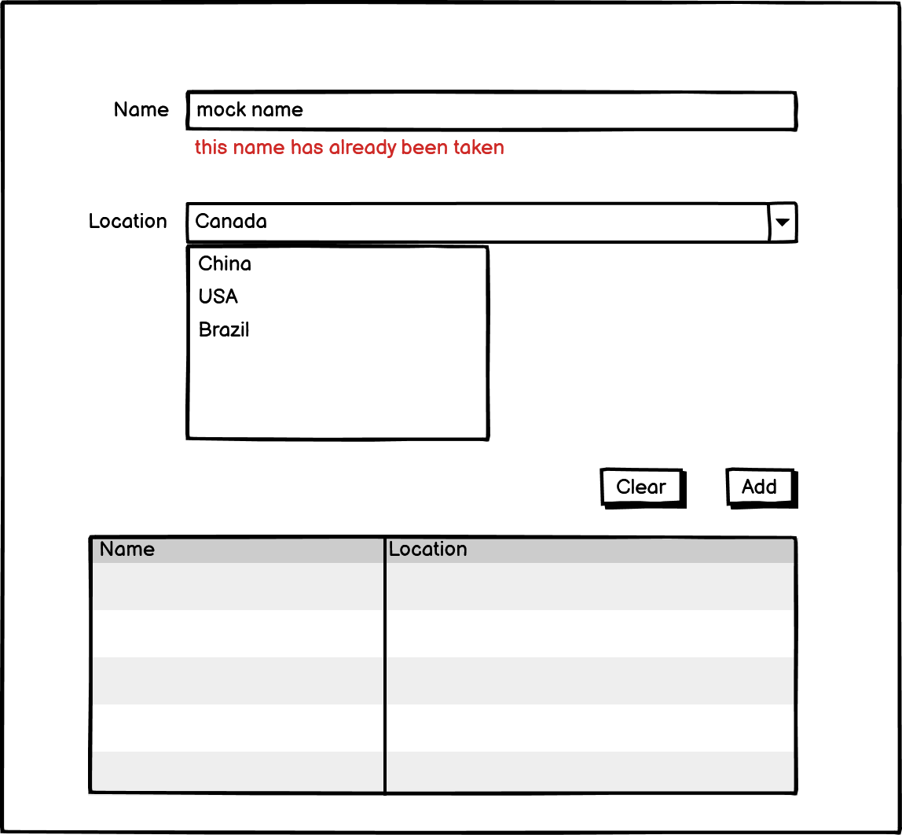

# react-interview-q1

## Instructions

Fork this repo first into your own github account. Make sure to thoroughly read the instructions and implement the react component to meet the provided requirements. Send back a link to your cloned repo. You are expected to make implementation choices around customer experience and efficiency. Please make sure to explain your choices in comments.

## Requirements

Please build the following form component

* Name input should be validated using the provided mock API to check whether the chosen name is taken or not.
* Name input should be validated as the user is typing.
* Location dropdown options should be fetched using the provided mock API.
* Component should have a responsive layout
* Component should be appropriately styled
* Unit tests are not required